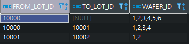
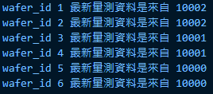

### Solution: 
- set input data format  
```java
package exercise;

import java.util.List;

public class InputData {
    int id;
    List<String> wid;

    public InputData(int id, List<String> wid){
        this.id = id;
        this.wid = wid;
    }
}

```

- connect MySQL get data and do SQL
```java
package exercise;

import java.sql.*;
import java.util.ArrayList;
import java.util.Arrays;
import java.util.List;


public class sqlTest {

    // 連線資訊
    private static String dbHost="127.0.0.1";             
    private static String dbName="javaTest";                     
    private static String userName = "root";               
    private static String userPassword = "xxxxxxxx";       
    private static String dbPort="3306";         
    
    public static void main (String[] args) throws Exception {
        
        InputData data = new InputData(10002, Arrays.asList("1", "2", "3", "4", "5", "6"));
        List<String> wid = new ArrayList<>(data.wid);
        try (Connection conn =getMySqlConnection();) {
                // 直接從最新被更新的 wid 降冪排序
                PreparedStatement ps = conn.prepareStatement(String.format("SELECT * FROM SEARCH_HIS WHERE TO_LOT_ID <= %s OR TO_LOT_ID IS NULL ORDER BY TO_LOT_ID DESC;", data.id));
                ResultSet rs = ps.executeQuery();
                while (rs.next()) {
                    for (String s: rs.getString("WAFER_ID").split(",")){
                        if(wid.contains(s)){
                            if(rs.getBoolean("TO_LOT_ID")){
                                // 若 TO_LOT_ID is NULL
                                System.out.println(String.format("wafer_id %s 最新量測資料是來自 %s", s, rs.getString("TO_LOT_ID")));
                                wid.remove(s);
                            } else{
                                // 若非 null 因降冪排序，FROM_LOT_ID 即是最新的
                                System.out.println(String.format("wafer_id %s 最新量測資料是來自 %s", s, rs.getString("FROM_LOT_ID")));
                                // 已找到，將 wafer_id 移出 list
                                wid.remove(s);
                            }
                        }
                    };
                }
        }
    }

    /**
     * @功能描述：   獲取資料庫連線
     *
     * @return
     * @throws Exception 
     */
    public static Connection getMySqlConnection() throws Exception {
        Class.forName("com.mysql.cj.jdbc.Driver");
        String url="jdbc:mysql://"+dbHost+":"+dbPort+"/"+dbName+"?useUnicode=true&characterEncoding=utf-8&port="+dbPort+"&autoReconnect=true";
        return DriverManager.getConnection(url,userName,userPassword);
    }
}
```

- Data  


- Input  
```
(10002, (1,2,3,4,5,6))
```

- Result  
